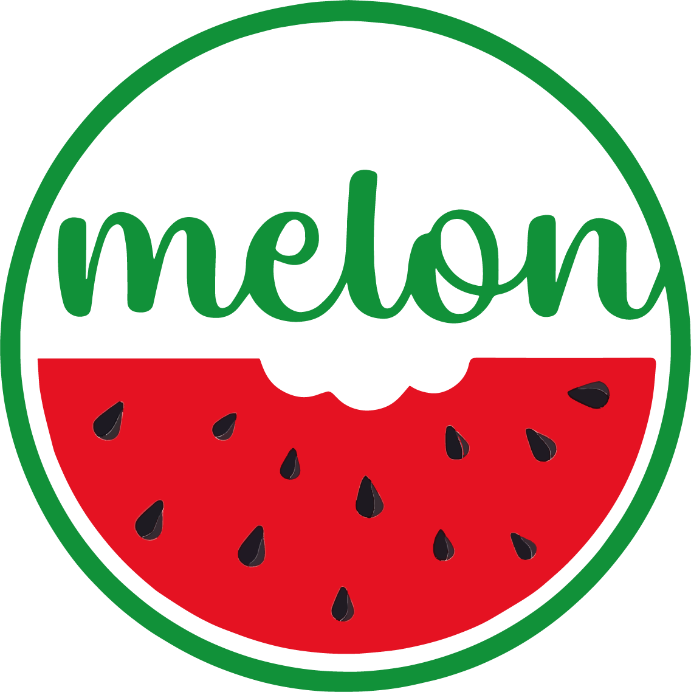

# Car Damage Assessment API — Integration Guide

<p align="center">
  
</p>

<p align="center">
  <strong>Provided by Melon Insurtech for Chubb</strong><br/>
  <em>Enterprise-grade computer vision for automotive insurance claims</em>
</p>

---

## Overview

A hosted API that analyzes a photo of a damaged car and returns a structured
damage report: part-by-part detection, damage type classification, severity
assessment, and a repair-versus-replace recommendation. The service is
deployed on Google Cloud Run in the Dammam region (`me-central2`) for low
latency to Saudi-based clients.

**Pipeline:**

```
 Photo ──► Layer 1: Part Detection  (YOLOv8x, 13 part classes)
       └─► Layer 2: Damage Classification  (ConvNeXt-V2-L, 9 damage types)
       └─► Layer 3: Severity + Repair/Replace  (Swin V2-L, 4 grades)
                     │
                     ▼
                  Claim Report (JSON)
```

---

## 1. Base URL

```
https://car-damage-api-290237594473.me-central2.run.app
```

A Melon-owned custom domain (`damage-api.melon.sa`) will replace this URL
before production go-live; the API key stays the same.

---

## 2. Authentication

Every request except `GET /health` must include an API key in the
`X-API-Key` header:

```
X-API-Key: <your-api-key>
```

Invalid or missing keys return `401 Unauthorized`. Keys rotate on a
schedule coordinated between Melon and Chubb security.

---

## 3. Endpoints

| Method | Path | Purpose | Auth |
|---|---|---|---|
| `GET` | `/health` | Liveness check | none |
| `POST` | `/assess` | Synchronous single-image assessment | ✓ |
| `POST` | `/assess/batch` | Async batch of up to 50 images | ✓ |
| `GET` | `/jobs/{job_id}` | Batch job status + result | ✓ |
| `POST` | `/feedback` | Submit adjuster correction | ✓ |
| `GET` | `/metrics` | Prometheus metrics (ops use only) | none |
| `GET` | `/docs` | Interactive OpenAPI docs | none |

---

## 4. `POST /assess` — Single image

Upload a single damage photo (JPEG or PNG). Returns a `ClaimReport`.

### Request

```http
POST /assess HTTP/1.1
Host: car-damage-api-290237594473.me-central2.run.app
X-API-Key: <your-api-key>
Content-Type: multipart/form-data

file=@/path/to/damage.jpg
```

### Response (`200 OK`)

```json
{
  "image_id": "IMG_3365.PNG",
  "image_width": 1327,
  "image_height": 770,
  "parts_detected": 4,
  "parts_damaged": 4,
  "parts_requiring_replacement": 4,
  "overall_assessment": "total_loss",
  "parts": [
    {
      "part": "door",
      "class_id": 3,
      "detection_confidence": 0.966,
      "bbox_xyxy_px": [763, 127, 1024, 604],
      "bbox_xyxy_norm": [0.575, 0.165, 0.772, 0.784],
      "damaged": true,
      "damage_types": [
        {"type": "dent", "probability": 0.999}
      ],
      "primary_damage_type": "dent",
      "severity": {
        "grade": "severe",
        "grade_index": 2,
        "grade_confidence": 0.612,
        "probs": {"minor": 0.08, "moderate": 0.08, "severe": 0.61, "total_loss": 0.23}
      },
      "recommendation": "replace",
      "repair_probability": 0.0,
      "replace_probability": 1.0,
      "pretrained_baseline": false
    }
  ],
  "pretrained_baseline": false,
  "model_versions": {
    "layer1": "yolov8x_v1",
    "layer2": "convnextv2_large_v1",
    "layer3": "swinv2_large_v1"
  },
  "warnings": [],
  "inference_ms": 22687,
  "schema_version": "1.0"
}
```

### Key fields

| Field | Meaning |
|---|---|
| `parts_detected` | How many car parts Layer 1 localized |
| `parts_damaged` | How many of those parts are damaged (L2/V2) |
| `parts_requiring_replacement` | How many need replacement (severe + repair/replace head) |
| `overall_assessment` | `clean` \| `minor_damage` \| `major_damage` \| `total_loss` |
| `parts[].damaged` | `false` if the part is present but undamaged (L2 V2 only) |
| `parts[].primary_damage_type` | Top damage label above the `0.5` threshold |
| `parts[].severity.grade` | `minor` \| `moderate` \| `severe` \| `total_loss` |
| `parts[].recommendation` | `repair` \| `replace` — bound to severity + repair head |
| `pretrained_baseline` | `true` means a model failed to load fine-tuned weights; result is not reliable |

### Latency

- **Warm instance:** 3-10 seconds depending on image size.
- **Cold start (first request after idle):** 60-90 seconds. Cloud Run
  scales to zero when idle to save cost. Call `GET /health` once to warm
  a container before a batch of real requests.

### Part vocabulary (Layer 1)

`bumper`, `hood`, `fender`, `door`, `windshield`, `headlight`, `taillight`,
`mirror`, `trunk`, `roof`, `quarter_panel`, `grille`, `wheel`.

### Damage vocabulary (Layer 2)

`dent`, `scratch`, `crack`, `shatter`, `tear`, `deformation`, `paint_loss`,
`puncture`, `misalignment`. The V2 release adds `no_damage` for explicit
false-positive suppression.

### Severity vocabulary (Layer 3)

`minor`, `moderate`, `severe`, `total_loss` (ordinal).

---

## 5. `POST /assess/batch` — Async batch

For processing 2-50 images in one shot. Returns a `job_id` immediately.

### Request

```http
POST /assess/batch HTTP/1.1
X-API-Key: <your-api-key>
Content-Type: multipart/form-data

files=@photo1.jpg
files=@photo2.jpg
files=@photo3.jpg
```

### Response (`202 Accepted`)

```json
{
  "job_id": "5f3a7c9b-...",
  "status": "queued"
}
```

### Poll `GET /jobs/{job_id}`

```json
{
  "job_id": "5f3a7c9b-...",
  "status": "succeeded",
  "result": [ { /* ClaimReport */ }, { /* ClaimReport */ }, ... ]
}
```

`status` is one of `queued`, `running`, `succeeded`, `failed`, `unknown`.

---

## 6. `POST /feedback` — Submit adjuster correction

**This is the most important endpoint for long-term model quality.**
Every time a Chubb adjuster overrides the model's output in your UI,
call this endpoint with the original + corrected report. Submissions are
written to a private Cloud Storage bucket and fed into the weekly
retraining pipeline.

### Request (JSON only, no image re-upload)

```http
POST /feedback HTTP/1.1
X-API-Key: <your-api-key>
Content-Type: application/json
```

```json
{
  "claim_id": "CHUBB-CLM-2026-00042",
  "adjuster_id": "jane.smith@chubb.com",
  "original_report": { /* the ClaimReport you received from /assess */ },
  "corrected_parts": [
    {
      "part": "door",
      "damaged": false,
      "damage_types": [],
      "primary_damage_type": null,
      "severity": null,
      "recommendation": null,
      "adjuster_notes": "Door is actually fine — model false-positived."
    },
    {
      "part": "bumper",
      "damaged": true,
      "damage_types": ["deformation", "puncture"],
      "primary_damage_type": "deformation",
      "severity": "severe",
      "recommendation": "replace",
      "adjuster_notes": "Bumper destroyed but L1 missed the detection."
    }
  ],
  "corrected_overall_assessment": "total_loss",
  "notes": "L1 missed bumper, L2 false-positive on door."
}
```

### Request (multipart, with re-uploaded image)

If you want to archive the original image alongside the correction
(recommended), use multipart:

```
X-API-Key: <key>
Content-Type: multipart/form-data

feedback=<JSON string of the above body>
image=@/path/to/photo.jpg
```

### Response (`201 Created`)

```json
{
  "feedback_id": "a1b2c3d4e5f6...",
  "claim_id": "CHUBB-CLM-2026-00042",
  "stored_at": "gs://melon-491511-cv-feedback/feedback/CHUBB-CLM-2026-00042/a1b2c3d4...",
  "status": "stored"
}
```

### What to correct

Submit a `FeedbackPart` for any part the adjuster touches:

- **False positives** — model said damaged, actually clean. Set `damaged: false`.
- **Missed parts** — model didn't detect a damaged part. Add a new entry with
  the correct `part`, `bbox_xyxy_px`, `damaged: true`, corrected damage types.
- **Wrong damage type** — `damaged: true` + corrected `damage_types` list.
- **Wrong severity** — update `severity` and `recommendation`.

If the adjuster didn't change anything, send an empty `corrected_parts: []`
with `notes: "Adjuster confirmed model output"`. This is still valuable
signal (positive reinforcement).

---

## 7. `GET /health`

```json
{
  "status": "ok",
  "version": "0.1.0",
  "device": "cpu",
  "models_loaded": true,
  "pretrained_baseline": false
}
```

Use this as a warmup ping and a liveness probe.

---

## 8. Rate limits

| Endpoint | Limit | Burst |
|---|---|---|
| `POST /assess` | 30/min per client IP | — |
| `POST /assess/batch` | 10/min per client IP | — |
| `POST /feedback` | 60/min per client IP | — |
| All others | 120/min (default) | — |

Exceeding returns `429 Too Many Requests`. Back off for 5 seconds and retry.

---

## 9. Error codes

| HTTP | Meaning | Action |
|---|---|---|
| `400` | Bad image / missing fields | Validate payload client-side |
| `401` | Missing or invalid API key | Re-check `X-API-Key` header |
| `413` | Image too large (> 16 MiB) | Resize to ≤ 4000px longest edge |
| `429` | Rate limited | Back off 5s + retry |
| `500` | Inference error | Paste the `x-request-id` response header when reporting |
| `503` | Models still loading / store down | Retry after 30s |

Every response carries an `x-request-id` header. Include it in bug reports
so Melon can look up the Cloud Logging trail.

---

## 10. Example clients

### curl

```bash
curl -s https://car-damage-api-290237594473.me-central2.run.app/assess \
     -H "X-API-Key: $CHUBB_API_KEY" \
     -F "file=@/tmp/damaged_car.jpg" | jq
```

### Python (requests)

```python
import os, requests, json

API_BASE = "https://car-damage-api-290237594473.me-central2.run.app"
API_KEY  = os.environ["CHUBB_API_KEY"]

def assess(path: str) -> dict:
    with open(path, "rb") as f:
        r = requests.post(
            f"{API_BASE}/assess",
            headers={"X-API-Key": API_KEY},
            files={"file": (path, f, "image/jpeg")},
            timeout=300,
        )
    r.raise_for_status()
    return r.json()

def submit_feedback(claim_id: str, adjuster_id: str, original: dict, corrections: list) -> dict:
    body = {
        "claim_id": claim_id,
        "adjuster_id": adjuster_id,
        "original_report": original,
        "corrected_parts": corrections,
    }
    r = requests.post(
        f"{API_BASE}/feedback",
        headers={"X-API-Key": API_KEY, "Content-Type": "application/json"},
        data=json.dumps(body),
        timeout=30,
    )
    r.raise_for_status()
    return r.json()

if __name__ == "__main__":
    report = assess("/tmp/damaged_car.jpg")
    print(json.dumps(report, indent=2))
```

### Postman

Import this snippet into Postman:

```http
POST {{base_url}}/assess
X-API-Key: {{api_key}}
Content-Type: multipart/form-data; boundary=---form---

-----form---
Content-Disposition: form-data; name="file"; filename="car.jpg"
Content-Type: image/jpeg

<binary>
-----form-----
```

---

## 11. Data residency and privacy

- All model inference runs in **Google Cloud me-central2 (Dammam)**.
- Uploaded claim photos are **not persisted** by the API unless explicitly
  attached to a `/feedback` submission.
- Adjuster feedback bundles are stored in a private Cloud Storage bucket
  (`gs://melon-491511-cv-feedback/`) with a 365-day retention policy and
  IAM locked to Melon + Chubb-approved reviewers.
- API keys are managed in Google Secret Manager and rotated on request.

---

## 12. Known limitations (as of v4)

1. **Missing parts are under-detected.** Heavily damaged areas where the
   part is physically destroyed (e.g. crushed bumper) may not be detected
   by Layer 1. Corrections via `/feedback` feed the fix.
2. **Side windows / rear glass weak.** Layer 1 training set had limited
   windshield examples and no side-window class. Shattered side windows
   are often missed; flag via `/feedback` with the correct bbox.
3. **`roof` and `grille` classes untrained.** Layer 1 has the class IDs but
   no training data yet — detections for these parts won't occur.
4. **Cold-start latency.** First request after 15+ min of inactivity takes
   ~60s. Warm with `GET /health` before a burst.

All known issues are tracked in the Melon-side retraining pipeline;
improvements ship roughly weekly.

---

## 13. Support

- **Integration help:** <ops@melon.sa>
- **Production incidents (24/7):** provided separately via Chubb escalation
- **Model quality feedback (non-urgent):** include `x-request-id` and
  `claim_id` in your email

---

*Last updated 2026-04-21. API schema version: `1.0`.*
